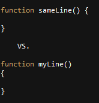

## Standards exist for a reason

Have you ever started coding on a project already in development to find the code unreadable? If so, this is why we try to stick to coding standards. Coding standards is something everyone should follow since code one-person writes may be viewed by another. And if that code follows coding standards, any other developer can understand what the code does instead of debating whether one if-statement is inside of another or not.

## Change is Good

Working with ESLint, it uses a different coding style than what I am used to; it enforces having opening brackets on the same line as a function or a loop, while I usually try to keep my brackets on their own line. It has been a struggle to constantly remind myself to keep the brackets on the same line to match the ESLint style since I tend to default back to the brackets on their own lines. ESLint makes it easier to see more of the code at once since lines are saved when opening brackets aren’t on their own line. However, I feel it comes with the trade off of being slightly harder to keep track of where a block of code starts and ends, but others may state that the ending bracket and ‘while’, ‘for’, or function name are enough to see it clearly. And at the same time, the ESLint style has the code scrunched up, especially when writing if-else blocks where the ending bracket of an if-statement is on the same line as the ‘else’ and it’s opening bracket. Nonetheless, I'm fine with using a different type of coding style from what I'm used to doing because other people won't always be using the same style I prefer using.

## Code how you want (except if it's unreadable)

In the end, it's good to be able to conform to other coding standards since different people have different preferences. Some may prefer opening brackets on their own line while others prefer them on the same line, but we have to be able to do both if we have to. If we start editing previously written code, we don't want to change all the brackets to start on new lines; it would be faster to start coding with the same style the previous coder chose. It's good to be flexible and change to what's is needed at the time, but we should still choose a coding style easily readable for another developer to easily jump in and understand the code.
