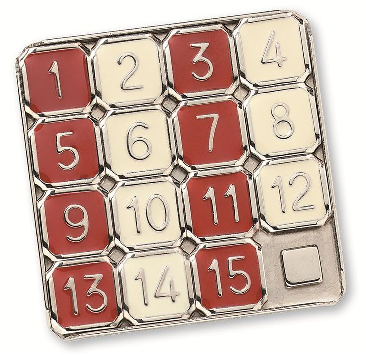

## I've seen this before...

Many of us have worked through the process of deciding how we want to solve a problem. After a while, we begin to see a similar solution for problems we see again and again. These problems seem like the same puzzle you've solved before, but this time the pieces to the puzzle are a little different or in a different order. The general idea to solve the problem is the same; there's just a different twist on the solution, such as in a sliding puzzle where the overall solution is the same with the pieces in different places. This is where design patterns come in: a general solution pattern to solve commonly occuring problems.

## If it works, keep on using it

There are many different design patterns created to help speed up development by offering a solid and proven solution template for problems that require the same overall design. So if a design pattern works for two similar problems, it's probably best to use that template to solve both problems without having to redesign a solution from scratch. At the same time, no two problems are the same, and that's why design patterns aren't set solutions to solve similar singleton problems. Instead, design patterns are intentionally slightly broad, so that a general solution can be used for two different problems but still require different changes in the actual code.

## It's the same, but different

For example, I've used the Model-View-Controller (MVC) design pattern for two different problems: a video game and a web page. Both required encapsulation to restrict users from directly accessing and possibly changing data. They both use a user interface for the user to send requests to change or retrieve data via the controller. At the same time, you wouldn't code every web page like a video game. The web page could be sending a form with data to a database, while the game is receiving inputs to move the character on the screen. In the end, design patterns help create a general solution to solving similar problems. However, no two problems are exactly the same, so design patterns can't be the exact solution to code. We use it as a general guideline instead.

