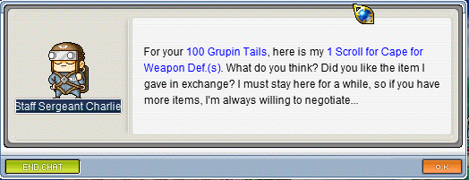

Released at the end of August 2017, MapleGlobal is a recreation of the first 39 versions of the original MapleStory. The modern version of MapleStory has long outgrown its original roots, but the demand and nostalgia for the early versions of many people's childhoods remain. MapleGlobal is a fanmade project created to allow many players a chance to relive their favorite verison of the game that released nearly 13 years ago, and hundreds of players have come together to experience and create a community within the game's starting point.

<div class="ui small rounded images">
  
</div>

For this project, I volunteered to work alongside others who have had a dream of playing the old verison of the game we all loved. I learned to write code for the many non-player character interactions the players encounter during their adventure in Javascript and later in C# when we reworked our source code. I've learned to work with the languages C# and Javascript, as well as the repository Assembla.

Here is some code that illustrates how we read values from the line sensors:

```js
byte ADCRead(byte ch)
{
    word value;
    ADC1SC1 = ch;
    while (ADC1SC1_COCO != 1)
    {   // wait until ADC conversion is completed   
    }
    return ADC1RL;  // lower 8-bit value out of 10-bit data from the ADC
}
```

The project is still ongoing, and I continue to script the many NPC interactions for future content in this fanmade project.
You can learn more at the [MapleGlobal](http://maplestory.global).


