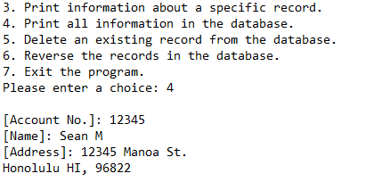

This program is a record keeper tasked during ICS 212, Summer 2017. This project taught me how to use Unix to compile my C/C++ code along with managing my files within the Unix environment using Makefiles and SCCS.

This record keeper allows users to input names and addresses associated with a unique account number. The program keeps track of added records through different sessions, and allows users to modify and delete existing records as well.

I gained experience in using C++ to code the record keeper, as well as using makefiles and SCCS within a Unix environment to help with management of the files involved in the project.
 

